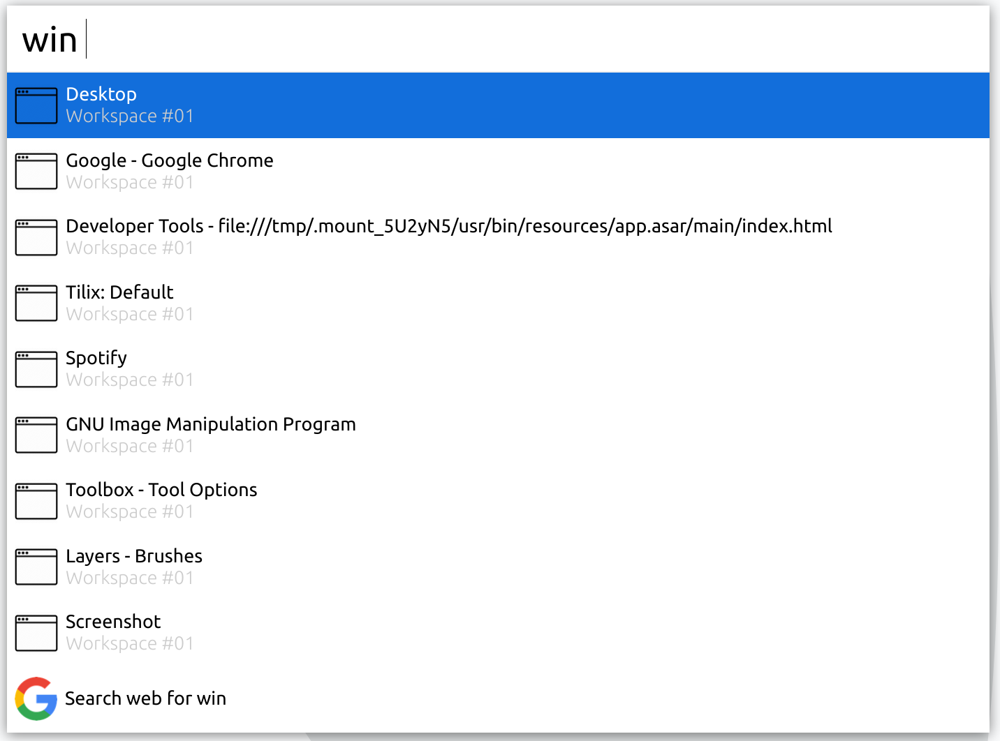

**This package is no longer maintained**

# cerebro-window-manager

> [Cerebro](https://cerebroapp.com) plugin to list open windows and raise or close them.



## Usage

In Cerebro, type `win` to see all open windows or just type window name without `win` to filter by.

Press `Enter` to raise the window or `Ctrl+D` to close the window gracefuly.

## Installing

* Note that this plugin depends on the `wmctrl` command so make sure you install that first  
For example you can use the command below to install wmctrl on ubuntu if it's not installed already  
```
sudo apt-get update
sudo apt-get install wmctrl
```

* Type `plugins manager` into Cerebro
* Click `install`

## Roadmap
These features are going to be included in the next versions.

* Show the correct window icon
* Show a screenshot of the highlited item in preview section 

## Related

- [Cerebro](http://github.com/KELiON/cerebro) – main repo for Cerebro app;

## License

MIT © [Amir Shahbandegan](https://shahbandegan.ir)
